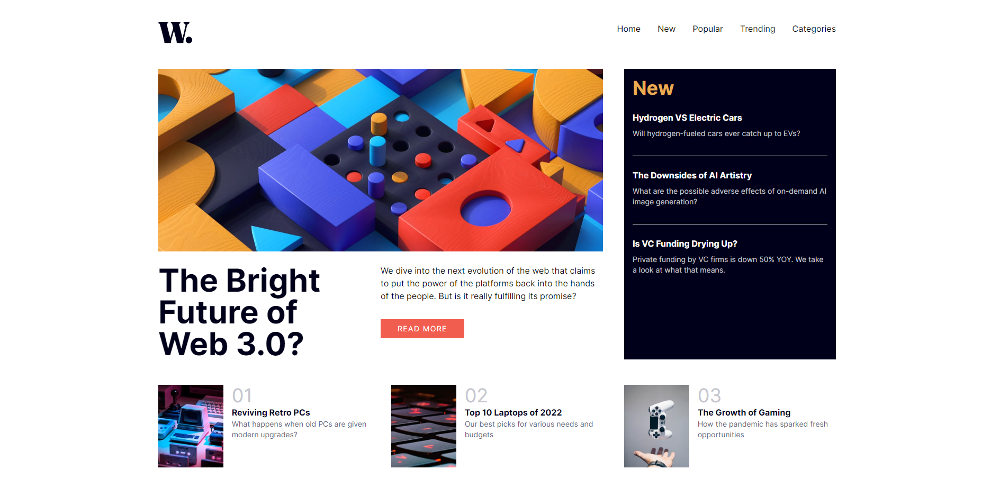
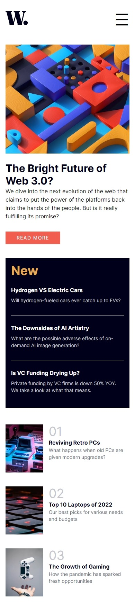

# Frontend Mentor - News homepage

## Table of contents

- [Overview](#overview)
  - [The challenge](#the-challenge)
  - [Screenshots](#screenshots)
  - [Links](#links)
- [My process](#my-process)
  - [What I learned](#what-i-learned)
  - [Possible upgrades](#possible-upgrades)

## Overview

### The challenge

The challenge concerned building out this news homepage and getting it looking as close to the design as possible.

### Screenshots

### Links

Solution URL: https://rafalbodanka.github.io/news-homepage/

## My process

### What I learned

For this challenge, I decided to try out Tailwind CSS for the first time. I have learned how to apply appropiate utility classes from Tailwind.
I learned also how to define my own tailwind subclasses to make my code more reusable.

Additionally, I exercised a little bit with dividing the project into React components.

### Possible upgrades

 - On hover snapshots of content of headers' elements.
 - Comments section.
